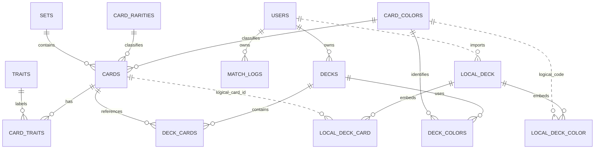

# MHR Dex Web: Product Requirements Document

## 1. Product Name

MHR Dex Web is an unofficial companion application for the Marvel Hero Rush Trading Card Game community in Indonesia.

## 2. Overview

MHR Dex Web helps players find card information, build decks, and record match results. The product runs as a web application built with Next.js. Card and match data use PostgreSQL through Drizzle ORM. Guest decks remain in the user's browser through IndexedDB. After login, the user can explicitly import a local deck into the cloud account. Cloud decks are then managed on the server without automatic two-way synchronization.

The product supports three main activities:

- Browse and filter the card catalog.
- Build and share decks.
- Record post-match results in an authenticated account.

## 3. Problem Statement

MHR players need a dedicated reference for card information and deck construction. They also need a consistent way to record individual match results without relying on scattered notes or general-purpose tools.

## 4. Target Users

- Casual players who need a quick card reference while learning the game.
- Competitive players who build decks and record match details.
- Players who need access from desktop and mobile browsers.

The primary persona is a player who searches cards, prepares decks, and records matches.

## 5. Goals

- Provide a searchable card catalog that works well on desktop and mobile browsers.
- Enforce the known deck construction rules before a completed deck is saved.
- Keep deck creation available in the current browser without requiring server persistence.
- Store match logs under the authenticated user's account.
- Keep the implementation small enough to build and verify one feature at a time.

## 6. Non-Goals

- Gameplay simulation.
- A digital implementation of the physical card game.
- Win-rate dashboards or aggregate match analytics.
- Official affiliation with Marvel, Card.Fun, or PT Jason Entertainment Indonesia.

The application must identify itself as an unofficial community companion.

## 7. Core Features

### 7.1 Authentication and Access

- Anyone can browse and search the card catalog without signing in.
- Match logs and account settings require Clerk authentication.
- Clerk provides Google and Apple sign-in.
- Guests may build local decks. Cloud deck operations and local-to-cloud import require authentication.
- Every protected server query and mutation must derive ownership from the authenticated session.

### 7.2 Card Database and Search

Each card contains:

- Official card code.
- Name.
- Color.
- Set.
- Rarity.
- Level from 1 through 6.
- Optional power.
- Optional range.
- Optional card type.
- One or more traits when available.
- Optional ability text.
- Optional flavor text.
- Optional image URL.

Users can search by name and filter by color, set, rarity, level, trait, and range. The detail view shows every available field.

PostgreSQL is the source of truth for the catalog. The browser does not maintain a separate catalog database.

### 7.3 Deck Builder

- A deck has one or two distinct identity colors.
- A deck contains no more than three copies of the same card.
- A deck contains no more than 50 cards in total.
- Every selected card must follow the deck's color identity rules.
- Deck sharing uses an exported deck code. Its encoding and versioning remain open in D5.
- Completed decks are stored in native browser IndexedDB.
- A deck is stored as one record containing its metadata, colors, and card entries.
- Saving the complete record in one transaction keeps a deck update atomic.
- Deck records contain card identifiers and quantities. Current card details are resolved from the cloud catalog.
- Guest decks stay in IndexedDB until the user chooses to import one after login.
- Importing creates a cloud deck under the authenticated account. It does not merge, overwrite, or delete the local deck.
- Authenticated users create and edit cloud decks. Changes to a cloud deck do not update the original local copy.

Whether incomplete deck drafts may be persisted remains open in D3. Until that decision is made, Zustand holds unfinished draft state and IndexedDB stores only completed records that pass validation.

### 7.4 Post-Match Log

Authenticated users can record a match with:

- A deck-name snapshot.
- One or two deck-color snapshots.
- Optional opponent name.
- Optional opponent colors.
- Optional player and opponent scores.
- Result: win, loss, or draw.
- Optional dice-roll result.
- Optional turn order.
- Optional match format.
- Match date and optional exact time.
- Optional location and notes.

The log stores snapshots instead of a live deck reference. Editing or deleting a browser-local deck must not change existing match history.

Result calculation, supported match formats, turn-order values, and display timezone remain open in D4. Until those rules are confirmed, the application stores an explicit result and must not infer it from scores.

### 7.5 Localization

- English is the default language.
- Indonesian is available from settings.

## 8. User Stories

- As a visitor, I can browse and filter cards without creating an account.
- As a player, I can filter cards by level from 1 through 6.
- As a player, I can inspect a card's traits, range, power, and ability text when those values are available.
- As a player, I can build a deck with one or two colors.
- As a player, I am prevented from saving a completed deck that exceeds the copy or card-count limits.
- As a player, I can export and import a deck through a versioned deck code once its format is defined.
- As a player, my decks remain available in the browser where I created them.
- As an authenticated player, I can record match details and see my own match history.
- As an authenticated player, I cannot read or modify another user's match logs.
- As a player, I can change the interface language between English and Indonesian.

## 9. Acceptance Criteria

### Card catalog

- Public visitors can reach the card list and detail pages.
- Name search and all documented filters return records matching the selected criteria.
- The level filter accepts only values from 1 through 6.
- Card detail renders optional fields only when data is present.

### Deck builder

- Validation rejects more than two colors.
- Validation rejects duplicate identity colors.
- Validation rejects a card quantity outside 1 through 3.
- Validation rejects a total quantity above 50.
- A successful save writes one complete deck record to IndexedDB.
- Reloading the page restores saved decks from the same browser profile and origin.
- An authenticated user can import a valid local deck as a new cloud deck.
- Import does not delete or overwrite the local deck.
- Cloud deck reads and mutations are restricted to the owning authenticated user.
- Storage failures produce a recoverable error state.

### Match log

- Unauthenticated visitors cannot access match-log routes.
- Every match-log operation uses the authenticated user's identity.
- A user can read and modify only their own logs.
- Deleting or changing a local deck does not alter existing match snapshots.
- Optional scores and match metadata can remain empty.
- The stored result is one of `win`, `loss`, or `draw`.

### Quality

- Desktop and mobile layouts have no horizontal overflow.
- Interactive controls are keyboard accessible and have visible focus states.
- Card and match-log views include loading, empty, and error states.
- Lint and TypeScript checks pass before a feature is considered complete.

## 10. Data Architecture

### 10.1 ERD Summary

The diagram shows the active cloud relationships and the local deck boundary. `LOCAL_DECK`, `LOCAL_DECK_COLOR`, and `LOCAL_DECK_CARD` describe fields embedded in the single IndexedDB `decks` object store. Their links to cloud records are logical application references, not PostgreSQL foreign keys.

`USERS ||..o{ LOCAL_DECK` represents an import action, not a stored local foreign key. A local deck remains browser-owned until the user explicitly creates a cloud copy.

### 10.2 Cloud Database

PostgreSQL stores the card catalog, users, match logs, and cloud decks. Drizzle table definitions and Drizzle Kit migrations are the implementation source of truth. `schema_cloud.md` defines the agreed data contract, and `schema_cloud.sql` remains the executable PostgreSQL reference.

The active cloud model used by this PRD consists of:

- `card_colors`
- `card_rarities`
- `sets`
- `cards`
- `traits`
- `card_traits`
- `users`
- `match_logs`
- `decks`
- `deck_colors`
- `deck_cards`

Cloud deck tables are active for authenticated users. They are populated by explicit import from a valid local deck or by creating a deck while authenticated. They do not participate in automatic two-way synchronization with IndexedDB.

### 10.3 Browser Database

Native IndexedDB stores browser-local decks. `schema_local.md` defines the object store, indexes, record shape, validation contract, upgrade rules, and lifecycle.

Version 1 uses one `decks` object store with `id` as its key path. Each record embeds the deck colors and card entries so one `readwrite` transaction can save the complete guest deck. The local record remains intact after import.

IndexedDB is accessed only from client-side modules. Server Components, Server Actions, Route Handlers, and middleware must not depend on it.

### 10.4 Data Boundaries

- The cloud catalog supplies current card data.
- IndexedDB stores only guest deck identifiers, metadata, color codes, card identifiers, quantities, and timestamps.
- PostgreSQL stores authenticated cloud decks, deck colors, and deck card quantities after explicit import or authenticated creation.
- Match logs remain server-side and account-scoped.
- Zustand stores temporary client state and does not replace either persistent data source.

## 11. Technical Direction

- Next.js with the App Router.
- TypeScript in strict mode.
- Tailwind CSS.
- PostgreSQL in Docker for local development.
- Drizzle ORM and Drizzle Kit for PostgreSQL access and versioned migrations.
- Clerk for authentication.
- Zustand for temporary client state.
- Native IndexedDB for browser-local deck persistence.

Server Components handle server reads where practical. Server Actions handle server mutations. Client Components are used for interactions that require browser state, including the deck builder and IndexedDB access.

## 12. Open Decisions

| ID | Decision | Current handling |
| --- | --- | --- |
| D3 | Final power, range, card-type, and trait taxonomies; exact versus maximum 50 cards; persisted incomplete drafts; copy limits across variants | Keep unresolved catalog fields optional and enforce only confirmed deck rules. Card level is resolved as a required integer from 1 through 6. |
| D4 | Score meaning, automatic result calculation, match formats, turn-order values, and display timezone | Store the explicit result and optional raw fields until the rules are confirmed. |
| D5 | Deck-code format, versioning, import behavior, and future synchronization conflicts | Treat deck codes as a planned interface without inventing a format. |

## 13. Related Documents

- `AGENTS.MD`: engineering rules, architecture boundaries, and open decisions.
- `schema_cloud.md`: PostgreSQL data contract.
- `schema_cloud.sql`: executable PostgreSQL reference for fresh databases.
- `schema_local.md`: IndexedDB data contract for browser-local decks.
- Drizzle Kit migrations: versioned, data-preserving changes for existing PostgreSQL databases.

When an open decision changes the product contract, update this PRD, AGENTS.MD, the applicable schema document, and the application schema in the same change.
