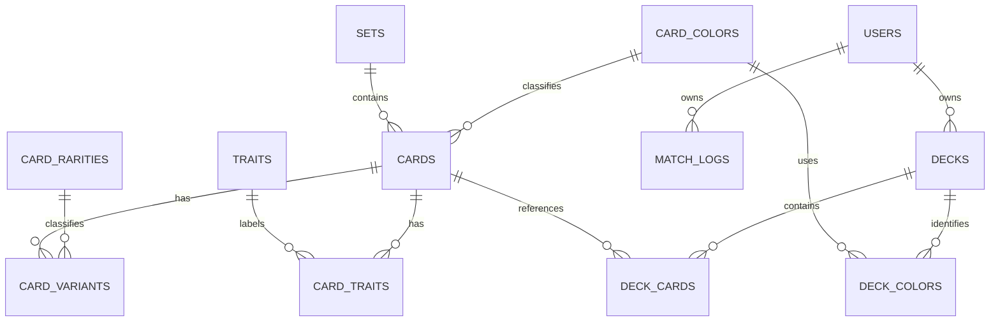

> Note: `ERD.MD` is retained as the original project ERD, and both documents describe the same revision.

# MHR Dex Web: Cloud Database Schema

This document defines the PostgreSQL data model used by the web application. `schema_cloud.sql` is the executable SQL reference. Drizzle table definitions and Drizzle Kit migrations must remain aligned with both files.

## Scope

The cloud database stores the card catalog, authenticated users, match logs, and authenticated cloud decks. Browser-local guest decks remain governed by `schema_local.md` and enter the cloud only through an explicit import.

## Conventions

- PostgreSQL UUID primary keys use `gen_random_uuid()` from `pgcrypto`.
- Timestamps with time zones use `timestamptz` and default to `now()` where specified.
- Application mutations must update `updated_at`; its default only supplies the insert value.
- Foreign keys use `ON DELETE CASCADE` only when the child record has no meaning without its parent.
- SQL names use `snake_case`. Drizzle table and column definitions must preserve these database names.

## Relationship map

## Card catalog

### `card_colors`

| Column | Type | Rules |
| --- | --- | --- |
| `code` | `text` | Primary key |
| `name` | `text` | Required |
| `sort_order` | `integer` | Required |
| `is_active` | `boolean` | Required; defaults to `true` |

Seed values are `blue`, `red`, `yellow`, `green`, `purple`, and `orange`. Purple and orange are reserved as inactive until released.

### `card_rarities`

| Column | Type | Rules |
| --- | --- | --- |
| `code` | `text` | Primary key |
| `sort_order` | `integer` | Required and unique |

Seed values, from highest sort priority to lowest, are `ER`, `GR`, `MR`, `PR`, `R`, `SEC`, `SR`, `TR`, and `UR`.

### `sets`

| Column | Type | Rules |
| --- | --- | --- |
| `id` | `uuid` | Primary key; generated |
| `code` | `text` | Required and unique |
| `release_date` | `date` | Optional |
| `description` | `text` | Optional |

### `cards`

| Column | Type | Rules |
| --- | --- | --- |
| `id` | `uuid` | Primary key; generated |
| `card_code` | `text` | Required and unique |
| `name` | `text` | Required |
| `color_code` | `text` | Required; references `card_colors.code` |
| `card_type` | `text` | Optional; final taxonomy remains open in D3 |
| `ability_text` | `text` | Optional |
| `flavor_text` | `text` | Optional |
| `set_id` | `uuid` | Optional; references `sets.id` |
| `created_at` | `timestamptz` | Required; defaults to `now()` |
| `updated_at` | `timestamptz` | Required; defaults to `now()` |

Indexes: `idx_cards_color`, `idx_cards_set`, and GIN full-text index `idx_cards_name` using the `simple` text-search configuration.

### `card_variants`

Each row represents a rarity and artwork variant of a base card. Decks reference the base card, not a variant.

| Column | Type | Rules |
| --- | --- | --- |
| `id` | `uuid` | Primary key; generated |
| `card_id` | `uuid` | Required; references `cards.id`; cascades on delete |
| `rarity_code` | `text` | Required; references `card_rarities.code` |
| `level` | `integer` | Required; value from 1 through 6 |
| `power` | `integer` | Optional |
| `range` | `text` | Optional; final taxonomy remains open in D3 |
| `image_url` | `text` | Optional permanent local or hosted path |
| `source_page_url` | `text` | Optional scraper provenance |

The (`card_id`, `rarity_code`) pair is unique. Indexes: `idx_card_variants_card`, `idx_card_variants_rarity`, and `idx_card_variants_level`.

### `traits`

| Column | Type | Rules |
| --- | --- | --- |
| `id` | `uuid` | Primary key; generated |
| `name` | `text` | Required and unique |

### `card_traits`

| Column | Type | Rules |
| --- | --- | --- |
| `card_id` | `uuid` | References `cards.id`; cascades on delete |
| `trait_id` | `uuid` | References `traits.id`; cascades on delete |

The composite primary key is (`card_id`, `trait_id`).

## Users and account data

### `users`

| Column | Type | Rules |
| --- | --- | --- |
| `id` | `uuid` | Primary key; generated |
| `clerk_user_id` | `text` | Required and unique |
| `email` | `text` | Optional |
| `created_at` | `timestamptz` | Required; defaults to `now()` |

Every account-scoped query and mutation must derive the user identity from the authenticated Clerk session.

### `match_logs`

| Column | Type | Rules |
| --- | --- | --- |
| `id` | `uuid` | Primary key; generated |
| `user_id` | `uuid` | Required; references `users.id`; cascades on delete |
| `deck_name` | `text` | Optional deck-name snapshot |
| `deck_color_1` | `text` | Required; references `card_colors.code` |
| `deck_color_2` | `text` | Optional; references `card_colors.code`; must differ from color 1 |
| `opponent_color_1` | `text` | Optional; references `card_colors.code` |
| `opponent_color_2` | `text` | Optional; requires and must differ from opponent color 1 |
| `opponent_name` | `text` | Optional |
| `player_score` | `integer` | Optional and nonnegative |
| `opponent_score` | `integer` | Optional and nonnegative |
| `turn_order` | `text` | Optional; allowed values remain open in D4 |
| `match_format` | `text` | Optional; allowed values remain open in D4 |
| `played_at` | `timestamptz` | Optional exact date and time |
| `result` | `text` | Required; `win`, `loss`, or `draw` |
| `won_dice_roll` | `boolean` | Optional |
| `match_date` | `date` | Required; defaults to current date; retained for date-only records |
| `location` | `text` | Optional |
| `notes` | `text` | Optional |
| `created_at` | `timestamptz` | Required; defaults to `now()` |

Index: `idx_match_logs_user` on `user_id`.

Match logs use snapshots rather than a deck foreign key. A log remains historically accurate when a browser-local or future cloud deck is edited or deleted. Result calculation and the relationship between `played_at` and `match_date` remain governed by D4.

## Cloud deck model

The following tables store decks owned by authenticated users. A user can create a cloud deck while logged in or import a validated guest deck from IndexedDB. Import creates a new cloud copy and leaves the local record unchanged. The application does not perform automatic two-way synchronization.

### `decks`

| Column | Type | Rules |
| --- | --- | --- |
| `id` | `uuid` | Primary key; generated |
| `user_id` | `uuid` | Required; references `users.id`; cascades on delete |
| `name` | `text` | Required |
| `created_at` | `timestamptz` | Required; defaults to `now()` |
| `updated_at` | `timestamptz` | Required; defaults to `now()` |

Index: `idx_decks_user` on `user_id`.

### `deck_colors`

| Column | Type | Rules |
| --- | --- | --- |
| `deck_id` | `uuid` | References `decks.id`; cascades on delete |
| `color_code` | `text` | References `card_colors.code` |

The composite primary key is (`deck_id`, `color_code`). The application must enforce one or two distinct colors per deck on both direct cloud creation and local imports.

### `deck_cards`

| Column | Type | Rules |
| --- | --- | --- |
| `deck_id` | `uuid` | References `decks.id`; cascades on delete |
| `card_id` | `uuid` | References `cards.id` |
| `quantity` | `integer` | Required; defaults to 1; between 1 and 3 |

The composite primary key is (`deck_id`, `card_id`). The application must atomically enforce total card count, copy limits, and deck-color membership.

## Migration rules

- Use versioned Drizzle Kit migrations for existing databases. Do not rerun the fresh-install SQL against populated environments.
- Backfill existing card attributes into `card_variants` before dropping the former variant columns from `cards`.
- Review destructive or lossy migrations before applying them.
- Apply schema migrations before deploying application code that requires the new fields.
- Keep `schema_cloud.md`, `schema_cloud.sql`, `src/db/schema.ts`, and the Drizzle migration history synchronized.
